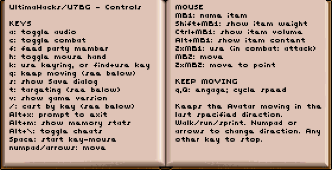

# Ultima Hacks

* [Overview](#overview)
* [Ultima VII: The Black Gate, Ultima VII Part Two: Serpent Isle](
    #ultima-vii-the-black-gate)
* [Ultima Underworld: The Stygian Abyss, Ultima Underworld II: Labyrinth of Worlds](
    #ultima-underworld-the-stygian-abyss)
* [How to Apply the Patches](#how-to-apply-the-patches)
* [How to Build the Patches (Advanced)](#how-to-build-the-patches-advanced)
* [More about UltimaPatcher](#more-about-ultimapatcher)

## Overview
Some modifications to the video games _Ultima VII: The Black Gate_ (1992),
_Ultima Underworld: The Stygian Abyss_ (1992), and _Ultima Underworld II:
Labyrinth of Worlds_ (1993), written as bits of (mostly 16-bit) x86 assembly,
together with a program, written in Java, that patches them into the game's
executable.

There is also a website (mentioned below) which can quickly apply pre-assembled
versions of the patches, for people not interested in building the patches
from source code.

The patches take the form of assembly files written in NASM syntax, and rely on
some supporting macros that include metadata in the assembled output files
regarding overall placement in the patched executable file as well as the
locations of segment references (in particular, the segment portions of far
procedure calls) which necessitate edits to the patched executable's relocation
tables.

Each game with patches applied is fully playable in DOSBox and most likely
on original (386/486) hardware as well (though I haven't had a chance to
test the patches on original hardware).

## Ultima VII: The Black Gate
## Ultima VII Part Two: Serpent Isle
Changes focus on improving usability - allowing the player to do things
more easily or more directly - and on adding keyboard control to what was
a largely mouse-driven game.

#### New abilities

- **Keep moving** in the same direction by pressing `q` or `Q`.
  - Press either key subsequently to change speed (walk, run, sprint, stop).

- Place a **bag or backpack** more easily within another, as each is now
  considered a *flexible* container, with volume corresponding to the
  sum of its contents, rather than being of a fixed size.

- **Cast spells by key** in real-time:
  - `/`: start casting
  - `<letter>`: add rune
  - `Backspace`: remove last rune
  - `Enter`: cast selected runes
  - (Hold `Shift` when opening or clicking the spellbook to see the rune-keys
    of each spell.)

- Select **party members by number** in many contexts:
  - `N`: open or target Nth party member
  - `Shift+N`: open or target Nth party member's backpack
  - `Alt+N`: open Nth party member's stats
  - *drag item*+`N`: give dragged item to Nth party member
  - Can be combined into compound actions:
    - `t`, `2`: talk to 2nd party member
    - `f`, `3`: feed 3rd party member
    - *cast spell*, `4`: target 4th party member with a spell
    - `t`, `g`, `g`, `2`: have 2nd party member get a nearby item
	- `t`, `t`, `t`, `2`: have 2nd party member attack a nearby NPC (in combat mode)

- (U7BG) **Target** with crosshairs, as in U7SI, with `t`.

- **Use keys to talk, use, get, or attack** (while targeting with crosshairs)
  - `t`: cycle NPCs
  - `r`: cycle usable items
  - `g`: cycle gettable items
  - `a`: cycle all items
  - `Enter`: select, use, talk, get, or attack with entire party
  - `N`: attack or get with Nth party member
  - `Esc`: cancel targeting
  
- **Select and use items**. (Originally available only in U7SI, without
  open dialogs; now available in U7BG and U7SI and even with open dialogs.)
  - `k`: find and use the key for a door or chest (emulating U7SI's keyring)
  - `f`: use food
  - `m`: use world map
  - `b`: use spellbook(s)
  - `p`: use lockpicks
  - `w`: use pocketwatch
  - `x`: use sextant
  - `g`: use abacus (to count party gold)
  - `o`: use Orb of the Moons (U7BG)
  - `j`: use Serpent Jawbone (U7SI)

- Query items' **weight, volume, and contents**:
  - `Shift+click`: show item weight
  - `Ctrl+click`: show item volume
  - `Alt+click`: show a container's first contained item
  - `Alt+click`: show a magic scroll's spell (U7SI)

- **Control conversations with keys**
  - `←→↑↓`, `Tab`, `Shift+Tab`: move cursor among options
  - `Enter`, `Ctrl`, `Space`: advance text; select option at cursor
    - These keys also advance the text of **books, scrolls, and signs**.

- Control **dialogs** more easily:
  - close most dialogs by right-clicking
  - select slots on the Save dialog with number keys or `↑↓`
  - select quantities with `←→`, `Shift+←→`, `↑↓`, and `Enter`.

- Use additional **keys in key-mouse mode** (initiated with `Space`):
  - `Tab`: cycle inventories
  - `Space`: stop key-mouse
  - `Esc`: stop key-mouse, close inventories

- **Toggle cheats** in-game by pressing `Alt+Backslash`.

- Press `Alt+k` in game, or click the image below, to see a comprensive,
  multi-page listing of **mouse and keyboard controls**.

  

#### Other changes

- (U7SI) The Dark Path map is now labeled with the names of destinations
  corresponding to held serpent teeth.

- The background is now darkened during conversation, to increase contrast
  and enhance the readability of text.

- (U7SI) The game no longer crashes if the player tries to open Combat Status
  with more than six party members.

- Some overwhelmingly loud or frequent background sounds (such as the
  flickering of fire swords) have been silenced or attenuated.

- The cheat-menu ability to set and inspect Game Flags has been restored.

- The fault address is now printed on a fatal divide-by-zero error.

## Ultima Underworld: The Stygian Abyss
## Ultima Underworld II: Labyrinth of Worlds
The biggest change is the addition of **mouse-look** (looking around by moving the mouse),
which can be toggled on and off with a keypress. In support of this, the allowed range
of vertical view angle has been greatly expanded, and the 3D rendering engine has been
hacked to have it draw the bits of the world that become visible when the player looks
sharply upward or downward.

Also, spell runes can be typed directly (with `Ctrl+Alt+<letter>`), without having to
navigate through the inventory and the rune bag.

Things made more convenient:
* The opening title-screen or cinematic is skipped.
* The player's heading is not adjusted when moving against a wall.
* Skill points gained in training are immediately reported in the message log
(currently only in Ultima Underworld II).

A number of **keys** have been added or changed. The most important:

    ` (Backquote): toggle mouse-look
            Alt+`: invert mouse-look axes (cycles through 4 states)
             wasd: movement, typical of modern shooters
            Space: attack (using last attack type, or slash)
            Shift: jump
                q: look at object in 3D view
                e: use object in 3D view
                z: display map
                r: flip to rune-bag panel
                f: flip to character panel

Keys for **spell-casting**:

      Ctrl+Alt+<letter>: select a rune
     Ctrl+Alt+Backspace: clear selected runes
         Ctrl+Alt+Space: cast the selected runes

Some miscellaneous keys:

                g: activate compass
                h: activate health and mana flasks
       Ctrl+Shift: standing long jump
            Shift: fly up
             Ctrl: fly down
                c: close container in inventory view
                v: scroll inventory down
                b: scroll inventory up

Keys for navigating the **map**:

                s: up one level
                w: down next level
                d: previous realm (Ultima Underworld II only)
                a: next realm (Ultima Underworld II only)
                c: go to Avatar's level

## How to Apply the Patches

These patches are intended to be applied to particular versions of the games,
all as distributed by GOG.com:
* Ultima VII 3.4
* Ultima Underworld vF1.94S
* Ultima Underworld II vF1.99S

Pre-assembled patches can be applied to a game's executable in seconds with
the **Hack Applier website**:

https://johnglassmyer.github.io/UltimaHacks/

To use the website, select the game executable file (U7.EXE, UW.EXE, or
UW2.EXE) from your installation of the game, select the corresponding "hack"
for that game from the drop-down, and then click the "Apply" button to save
a patched copy of the executable, with which you can replace the original
file in your installation of the game.

Game executables, as well as saved games, should be backed up before applying
patches. Always keep a copy of the original, un-patched executable on-hand.

Note that if you intend to patch a GOG.com installation of Ultima Underworld
or Ultima Underworld II that uses an ISO CD image (`game.gog`), then the
executable file you need to patch is contained within that CD image. In
that case, you can either

* extract the contents of the `game.gog` image to a directory using a program
such as 7-Zip, and then edit DOSBox's configuration to have it mount that
directory as the CD-ROM drive in place of the `game.gog` image, or

* extract the contents of `game.gog`, patch the executable, and then
build a new `game.gog` ISO with the patched executable included

## How to Build the Patches (Advanced)

If all you want to do is play the games with the patches applied, please use
the Hack Applier site mentioned in the preceding section.

Building the patches from source requires that NASM (for assembling the
individual patches), as well as a Java 1.9 or higher JDK and Apache Maven
(for building the _UltimaPatcher_ program), be installed and on the system
path.

On Windows systems, [Git for Windows](https://gitforwindows.org/) provides
a Bash shell capable of processing the example commands given.

The patch sources can be assembled to `.o` binaries by invoking NASM in the
`ultima7`, `uw1`, or `uw2` directory:

`for a in *.asm ; do nasm $a -o ${a/.asm/.o} ; done`

The Java program _UltimaPatcher_ must be built by invoking Maven in the
`UltimaPatcher` directory:

`mvn compile package`

Applying the patches requires that a particular overlay-segment of the game's
executable (U7.EXE, UW.EXE, or UW2.EXE) first be expanded to provide room for
several new procedures (this increases the executable's size by a few kilobytes).
This is the first task to be performed by the Java project built in the previous
step (`UltimaPatcher.jar` should be found in the `target` directory):

`java -jar UltimaPatcher.jar --exe=U7.EXE --expand-overlay=343:0x2000 --write-to-exe`

`java -jar UltimaPatcher.jar --exe=UW.EXE --expand-overlay=117:0x2200 --write-to-exe`

`java -jar UltimaPatcher.jar --exe=UW2.EXE --expand-overlay=93:0x2500 --write-to-exe`

Finally, _UltimaPatcher_ must be invoked again to apply the .o patches to each
executable. For example:

`for o in ultima7/*.o ; do java -jar UltimaPatcher.jar --exe=U7.EXE --patch=$o ; done`

`for o in uw1/*.o ; do java -jar UltimaPatcher.jar --exe=UW.EXE --patch=$o ; done`

`for o in uw2/*.o ; do java -jar UltimaPatcher.jar --exe=UW2.EXE --patch=$o ; done`

## More about UltimaPatcher

More generally, _UltimaPatcher_ has the capability to

* analyze the segment layout of a DOS executable that uses `FBOV` overlays
* expand overlay segments within such an executable (to make room for new code)
* compile a set of patches into a hack proto (a type of Google Protocol Buffer
data-serialization message)
* apply a set of patches or a previously compiled hack proto to an executable

The assembly file `UltimaPatcher.asm` provides NASM assembly macros used to
produce assembled object files containing metadata that _UltimaPatcher_ uses
to apply patch blocks to an executable.
